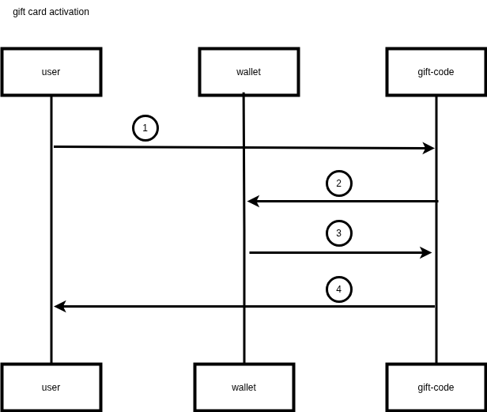

# gift activation



## Description

1. user place phoneNumber & GiftCode in request body and call `giftCardActivation` endpoint from giftCode component.
2. giftCode component checks if GiftCode is avalible and call `addCredit` endpoint from wallet component and give it the number.
3. wallet component checks if phone number exist and return `addCredit` request response to giftCode component, (accept/failure) while showing the balance after applying the GiftCode.
4. giftCode component return `giftCardActivation` request response.

# Api contract

## gift code

```
Name:   giftCardActivation
Method: POST
Url:    http://localhost:7878/gift/activate
Headers: no content
Body:
    {
        "phone": (string),
        "code":  (string)
    }
Errors:
    - code: 404
      Name: not found
      Body:
          {
            "error" : "giftCode does not exist",
          }
    - code: 500
      Name: Internal Server Error
      Body:
          {
            "error" : "internal error, please retry",
          }
    - code: 400
      Name: Bad Request
      Body:
          {
            "error" : "invalid request body",
          }
Response:
    - code: 200
      Name: StatusOK
      Body:
          {
            "message" : "GiftCode applied successfully",
            "current balance" : (int64)
          }
```

## wallet

```
Name:   addCredit
Method: Post
Url:    http://localhost:9898/wallet/AddCredit
Headers: no content
Body:
    {
       "mobileNumber" : (string),
    }
Errors:
    - code: 404 
      Name: Not Found
      Body:
          {
            "error" : "wallet does not exist",
          }
    - code: 500
      Name: Internal Server Error
      Body:
          {
            "error" : "failed to add credit, please try again later",
          }
Response:
    - code: 200
      Name: statusOK
      Body:
          {
            "message" : "GiftCode applied successfully",
            "current balance" : (int64)
          }
```
