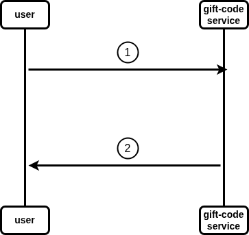

# gift-status



## descriptions

1. user palce giftCode in request body and calls `giftCodeStatus` endpont from the giftCode component
2. giftCode component returns request response (active or expired)

# api contract

## gift Code Status

```
Name:    GiftCodeStatus
Method:  Post
Url:     http://localhost:7878/gift/status
Headers: 
Body:
    {
        "giftCode" : (string)
    }
Errors:
   - code: 404
     Name: not found
     Body:
         {
            "error" : "GiftCode does not exist",
         }
   - code: 500
     Name: internal server error
     Body:
   - code: 400
     Name: bad request
     Body: 
         {
            "error" : "invalid request body",
         }
Responses:
       - code: 200
         Name: OK
         Body:
             {
                "message" : "the giftCode is active/expired"
             }
```
