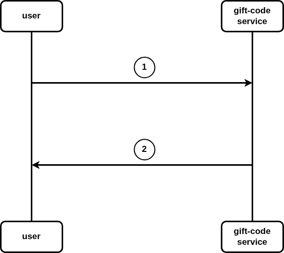

# giftCode usages report



## description
1. user place GiftCode in request body and calls `GiftCodeReport` endpoint from the giftCode component.
2. giftCode component returns request's response.(gift code usage list)

# Api contract

## GiftCode report
```
Name:   GiftCodeReport
Method: POST
Url:    https://localhost:7878/gift/report
Headers:
Body:
    {
        "giftCode" : (string),
    }
Errors:
   - code: 404
     Name: not found
     Body:
         {
            "error" : "GiftCode does not exist",
         }
   - code: 500
     Name: internal server error
     Body:
   - code: 400
     Name: bad request
     Body: 
         {
            "error" : "invalid GiftCode",
         }
Responses:
    - code: 200
      Name: ok 
      Body:
          {
            usage list(string)
          }
```